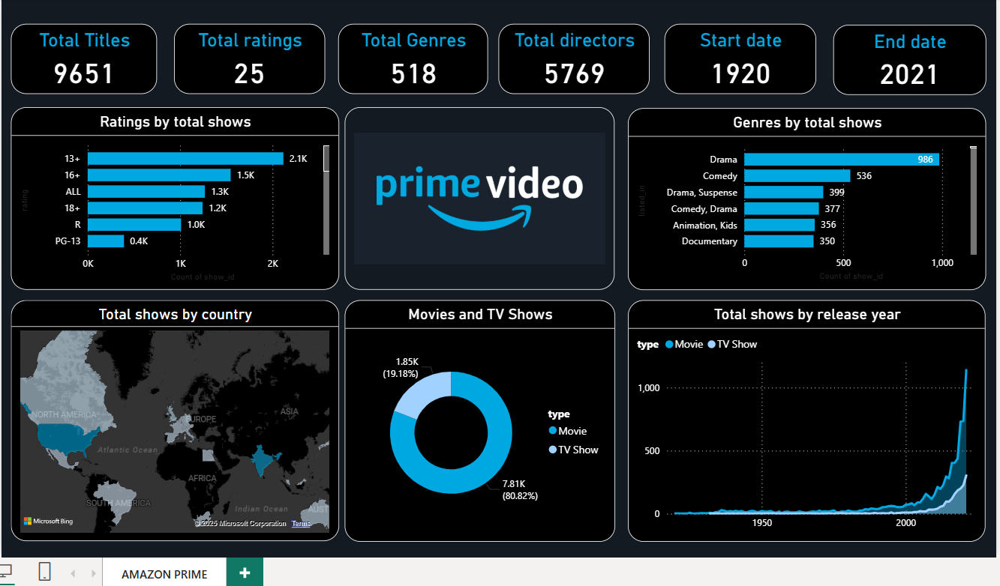
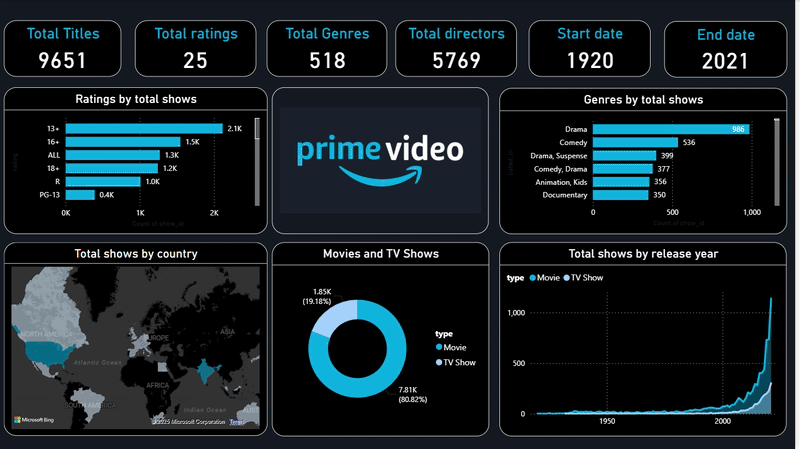

# Amazon Prime Power BI Dashboard 📊

This project showcases an **interactive Power BI dashboard** built using the *Amazon Prime Titles* dataset.  
It provides detailed insights into **Amazon Prime Movies & TV Shows** across multiple dimensions such as **genre, ratings, release year, and country**.  

The goal of this dashboard is to analyze Amazon Prime’s content library and uncover patterns & trends.

---

## 📂 Files in this Repository
- `amazon prime titles.xlsx` → Dataset containing Amazon Prime Movies & TV Shows  
- `amazon_prime_dashboard.pbix` → Power BI dashboard file  
- `amazon_prime_dashboard.png` → Dashboard screenshot  
- `dashboard_demo.gif` → Dashboard demo (animated preview)  
---

## 🖼 Dashboard Preview

### Animated Demo  
 
---

## 📊 Key Insights from the Dashboard
- Distribution of **Movies vs TV Shows**  
- Popular **genres** available on Amazon Prime  
- Content growth trend by **release year**  
- Country-wise distribution of titles  
- Ratings breakdown to understand **audience preferences**  

---

## 🛠 Tools & Technologies
- **Power BI** → For data cleaning, transformation, and visualization  
- **Excel (.xlsx)** → Dataset storage & preprocessing  

---

## 🚀 How to Use
1. Download the `.pbix` file and open it in **Power BI Desktop**.  
2. Explore the different visuals and filters.  
3. Modify or enhance the dashboard as per your analysis.  

---

## 📜 License
This project is licensed under the **MIT License**.
